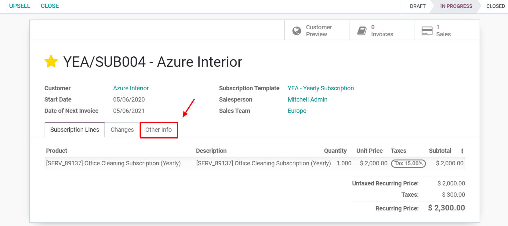

====================
Renew a subscription
====================

The key feature of a subscription business model is the recurring nature of payments. In this model,
customers pay a recurring amount in exchange for access to a product or a service.

.. raw:: html

   
 <b>The renewal of a
   subscription is the process followed by each customer when willing to pursue a
   subscription.</b> 

Each subscriber experiences this renewal process monthly, annually or sometimes more, depending on
the duration of the contract. Most subscription companies choose to automate their renewal
processes, but in some cases, manual subscription renewals are still the preferred option.

With **Odoo Subscriptions**, you can have all your subscriptions in one application, suggest to your
customers an automatic subscription renewals as a manual one and finally, filter all your
subscriptions and easily find those to renew (with the help of the tag *To renew*).

Configuration
=============

Renew your first subscription
=============================

Before renewing a subscription, be sure to check out our documentation on how to create a quotation
using subscription products, :doc:`../../subscriptions/sales_flow/create_a_quotation`. Indeed,
once confirmed, a quotation becomes a sales order

